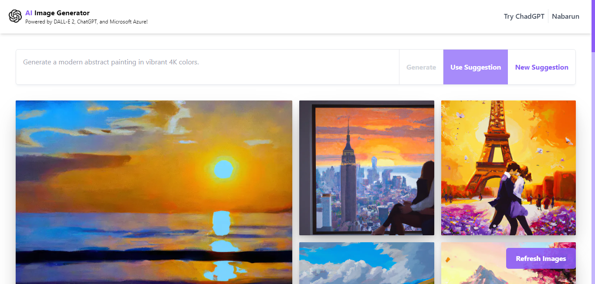

<!-- PROJECT LOGO -->
<br />
<div align="center">
  <a href="https://nabarun.ai">
    
  </a>

  <h2 align="center">AI Image Generator</h2>

  <p align="center">
    Say hello to the creative side of yours!
    <br />
    <a href="https://nabarun.ai"><strong>View Project »</strong></a>
    <br />
    <br />
    <a href="https://github.com/nabarvn/ai-image-generator/issues">Report Bug</a>
    ·
    <a href="https://github.com/nabarvn/ai-image-generator/issues">Request Feature</a>
  </p>
</div>


<!-- ABOUT THE PROJECT -->
## About The Project

<div align="center">
  
</div>

AI Image Generator is incredibly user-friendly, with a simple interface that allows you to input a description of the image you want to generate. The app then uses the power of Dall-E 2 to create a unique and relevant image that matches the prompt.


### Tech Stack:

- **Language**: [TypeScript](https://www.typescriptlang.org)
- **Framework**: [Next.js](https://nextjs.org)
- **Styling**: [Tailwind CSS](https://tailwindcss.com)
- **Analytics**: [Vercel Analytics](https://vercel.com/analytics)
- **Blob Storage**: [Microsoft Azure](https://azure.microsoft.com/en-us/free)
- **Data Fetching**: [SWR](https://swr.vercel.app/docs/getting-started)
- **API**: [OpenAI](https://platform.openai.com/docs/introduction)
- **Deployment**: [Vercel](https://vercel.com)


### Related:

-> <a href="https://github.com/nabarvn/dall-e-function-app"><strong>Azure Integration Code</strong></a>


<!-- RUN THE CODE LOCALLY -->
## Running Locally

This application requires Node.js v16.13+.

### Cloning the repository to the local machine:
```bash
git clone https://github.com/nabarvn/ai-image-generator.git
cd ai-image-generator
```

### Installing the dependencies:
```bash
npm install
```

### Running the application:
```bash
npm run dev
```


<!-- CREDITS -->
## Credits

Thanks to *Sonny Sangha* for all of the amazing and knowledge packed content that he puts out on the internet. I hope I was able to do justice to that!

<hr />

<div align="center">Don't forget to leave a STAR 🌟</div>
